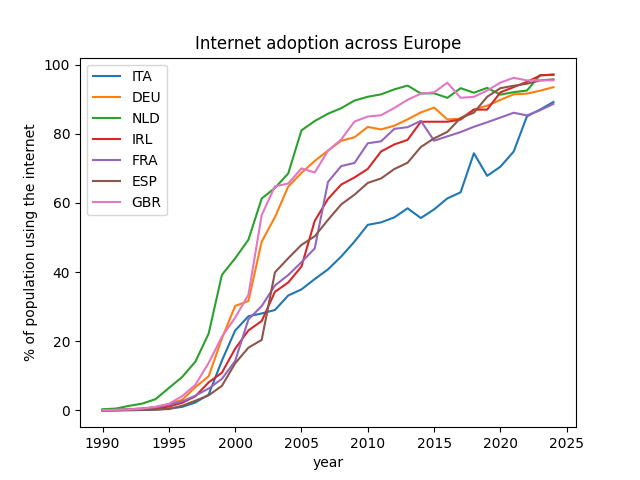

# Europe Digital Pipeline

Small Python data pipeline that collects digital development indicators for selected European countries from the World Bank API, stores the data in a local SQLite database, and generates visualisations of internet adoption trends

## Overview

The project runs as a five-stage pipeline:
1. **Extract** data from the World Bank API
2. **Clean** the data into structured rows
3. **Store** the data in a SQLite database
4. **Analyse** the stored data with pandas
5. **Visualise** internet adoption across the selected European countries

The focus is comparing digital development across Europe, with one visualisation highlighting Italy's internet adoption against the rest of the selected countries

## Countries and indicators

The analysis includes the following countries:
- Italy
- Germany
- Netherlands
- Ireland
- France
- Spain
- United Kingdom

The adopted indicators are:
- Individuals using the internet (IT.NET.USER.ZS)
- Fixed broadband subscriptions per 100 people (IT.NET.BBND.P2)
- Research and development expenditure (GB.XPD.RSDV.GD.ZS)
- High-technology exports (TX.VAL.TECH.MF.ZS)

## Results



The Netherlands and the United Kingdom adopted the internet earlier, while Italy stayed behind the group for roughly two decades. By 2024, however, all seven countries converge into a narrow band around 88–97% 


Highlighting Italy against the rest makes the catch-up clear:  it went through a steep climb in the 2000s and 2010s, and joined the pack near the top by the 2020s

## How to run

The database is generated when you run the pipeline and is not committed to the repository

```bash
#set up the environment
python3 -m venv venv
source venv/bin/activate
pip install -r requirements.txt

#build the database
python run.py

#generate the charts
python analyze.py
```

## Data source

All data comes from the World Bank API, which is open and requires no authentication
Years with no reported value are excluded from the charts